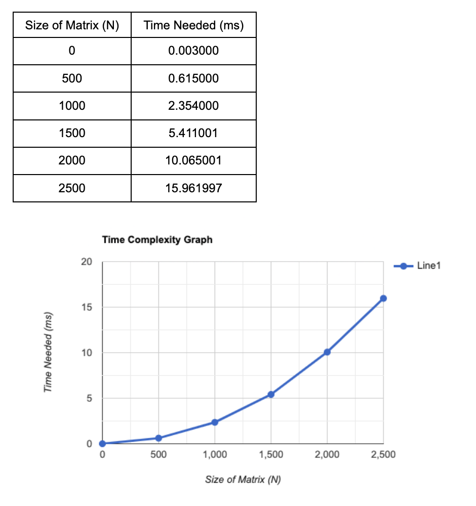
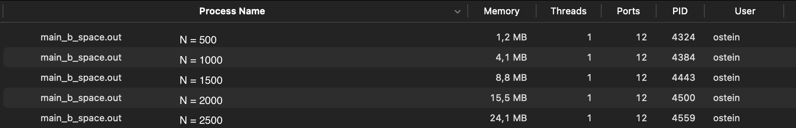
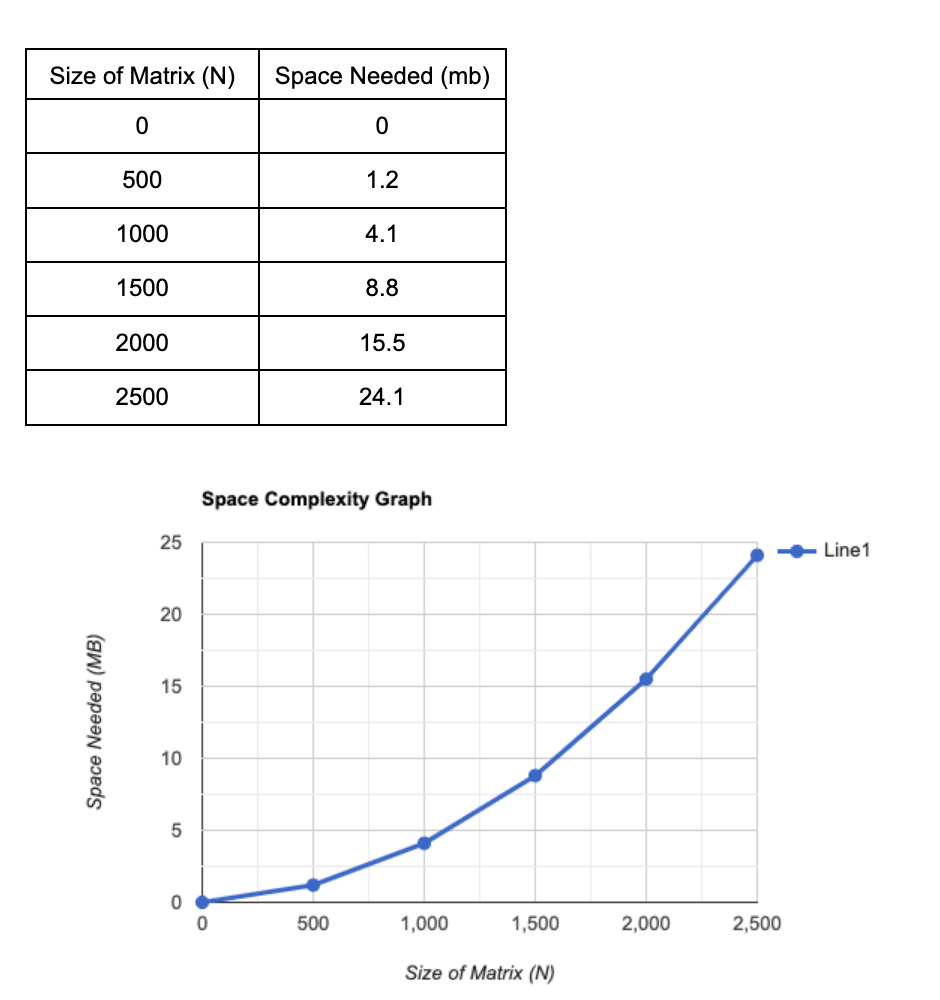

# Matrix Vector Multiplication

For this assignment, I will be running a program that will perform a matrix vector multiplication. I will also be analysing the time and space complexity of executing the program.

For this assignment, I will be running the program on MacOS.
## Testing the Program

###Running the program:

To run the program, I inputted the following command on the terminal:

###Command:
```
make; ./main.out
```

###Output:
```
Test #1:
Actual V[0] = 21; Expected V[0] = 21
Actual V[1] = 14; Expected V[1] = 14

Test #2:
Actual V[0] = 29; Expected V[0] = 29
Actual V[1] = 27; Expected V[1] = 27

Test #3:
Actual V[0] = 29; Expected V[0] = 29
Actual V[1] = 20; Expected V[1] = 20
```
This code tests out the `multiply_vector_matrix()` function which has four inputs: `Matrix`, `Vector`, `N`, and `vector_expected`. To test this function, I used three matrices and vectors with `N=2`. I calculated the results of the operation manually in order to compare it with result produced by the `multiply_vector_matrix()` function; with its results being displayed as `Actual` results and the results I calculated manually being displayed as `Expected` results. As we can see, the two results match, meaning that the function works correctly.

## Time Complexity

To check the time complexity of this program, I used the command below on the terminal. The purpose of this is to find the amount of time needed to calculate the multiplication of `N*N Matrix` with `N-Vector`. For this test, the value of `N` is `1000`.

###Command:
```
make time; ./main_b_time.out
```

###Output: 

```
Time elapsed: 2.363000 ms
```

In the case of `N=1000`, the amount of time needed (in milliseconds) to calculate the multiplication of `N*N Matrix` with `N-Vector` is `2.363000 ms`.

Below is a graph showing the amount of time needed to complete an operation relative to the size of the matrix.



## Space Complexity

To check the space complexity of this program, I used the command below on the terminal. The purpose of this is to find the amount of space used to calculate the multiplication of `N*N Matrix` with `N-Vector`. For this test, I will be using five different values for `N`, being `N = 500`, `N = 1000`, `N = 1500`, `N = 2000`, and `N=2500` respectively.

###Command:
```
make space; ./main_b_space.out
```

###Output:

After inputting the command, we open the the Activity Monitor to see multiple `main_b_space.out` programs running. 



The image above shows the amount of memory used from each instance. From the image above, we can conclude that the larger the matrix, the more space it will use.

Below is a graph showing the amount of space needed (in megabytes) to complete an operation relative to the size of the matrix.


